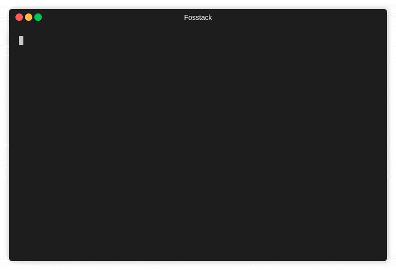

# Playlist Duration Count

A command-line tool to calculate the length of all the audios/videos in a directory



## Prerequisites

**ffmpeg** package is required for this package to work, so you need to get it installed on your system

To install ffmpeg on ubuntu

```
sudo add-apt-repository ppa:mc3man/trusty-media
sudo apt-get update
sudo apt-get install ffmpeg
sudo apt-get install frei0r-plugins
```

For other OS read instruction [here](https://github.com/adaptlearning/adapt_authoring/wiki/Installing-FFmpeg)


## Installing
hit up your terminal and type following command

```
$ pip install --user playlist-length
```

or
```
$ pip install --user -e git+
```


if your ~/.local/bin/ is not in PATH then run
```
$ export PATH=$PATH:${HOME}/.local/bin/
```

you may add above line of code in ~/.zshrc or ~/.bashrc etc. to repeat above step every time a terminal is opened.

To get length of all the videos in a directory, Give the path to directory as arguement
```
$ playlistlen path_to_directory
```

or use following command for current directory
```
$ playlistlen
```

By default, it will look for videos in given directory and it's sub-directories recursively, if you want it to look in the given directory only, then use **--no-subdir** flag, for example:
```
$ playlistlen path_to_directory --no-subdir
```

By default the media-type it will look for is `video` but you can specify `audio` or `both`

```
$ playlistlen path_to_directory --media-type audio
$ playlistlen path_to_directory --media-type both
```

for help use -h or --help, for example
```
$ playlistlen --help
```